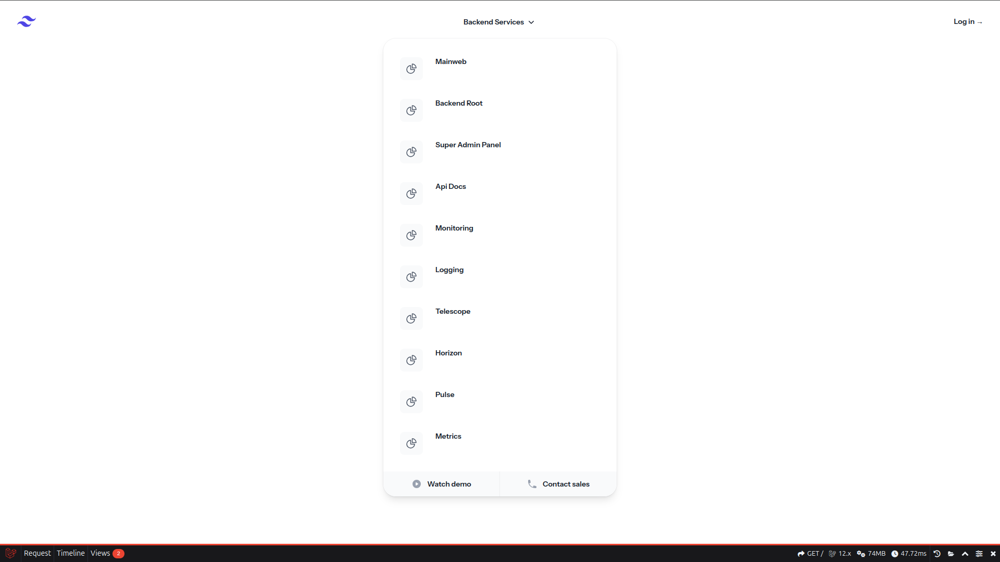
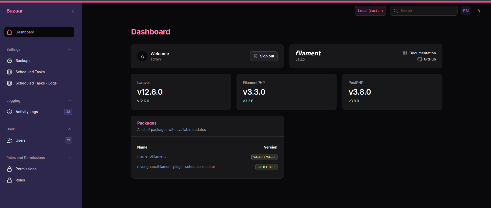

# Bazaar App Made With Laravel

    
Root

    
    
Admin

    

### Requirements for development
1. `LEMP` STACK (`LINUX`, `NGINX`, `MYSQL`, `PHP-FPM`)
2. `Composer` and `Git`
3. `NodeJS` and `NPM`
4. `REDIS` with php redis ext and `MONGO` (pecl install mongodb)

### HELP
1. use `make` to search useful `runtime` commands
2. use `php artisan find` to search `artisan` commands
3. use `php artisan schedule:test` to search `schdule` commands
4. use `php artisan docs` to search `laravel` document topics
5. use `php artisan changelog` to add new change log entry to __CHANGELOG.md file

### Guide
1. use `php artisan make:data-migration` to make data migrations when changing database states (not running in testing env)

### Super Admin Panel
1. goto http://bazaar.local/super-admin
2. use `admin` user credentials: admin@admin.com, password
3. use `ctrl+i` or `cmd+i` for global search modal
4. use `ctrl+k` or `cmd+k` for search resources
5. use `ctrl+shtf+a` or `cmd+shft+a` for quick create resources

### Setup
1. run `make fix-permissions` for fix project directory access
2. run `make setup` to configure Nginx for http://bazaar.local
3. apply required changes in env files (`MYSQL`, `REDIS`, `MONGO`, ...)
4. run `make dev` to an init project and start servers
5. if you use `herd` goto http://bazaar-laravel.test
6. for `admin` user use these credentials: admin@admin.com, password
7. activate your idea's `laravel pint` inspection
8. fill pusher credentials in .env for use `chatify`
9. you are up, `explore` and have `fun`

### Docker
1. run `make build` to build docker images
2. run `make composer run dev` to init project
3. run `make composer testpf` to create test databases and run tests parallel
4. run `make horizon` to start horizon

### Testing
1. apply required changes in .env.testing file
2. run `make testpf` for create test databases and run tests parallel
3. if you set up `coverage` engine like Xdebug, you can get coverage report

## Tasks
1. refactor image upload operations in controllers
2. define Repositories for important actions
3. complete end-to-end tests for api routes
4. complete enums for status, types and more
5. cron jobs for scheduled tasks
6. fix gates for tools (horizon panel and more)
7. fix global latest scope for models
