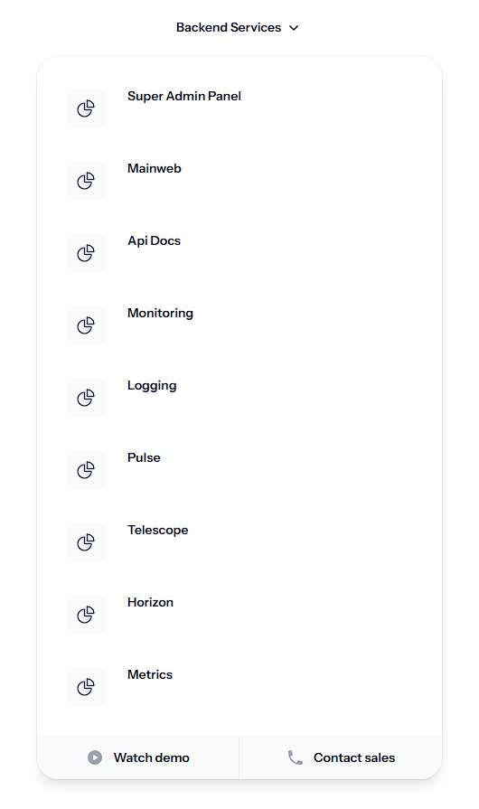
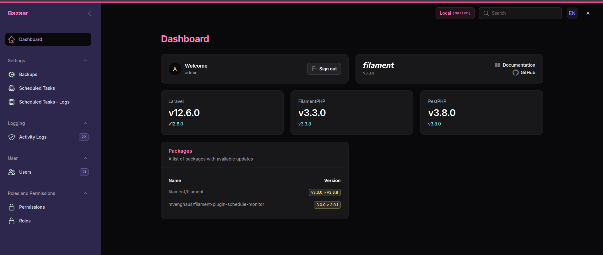

# Bazaar App Made With Laravel

    
Root

    
    
Admin

    

### setup
1. run `sh fix-permissions.sh`
2. copy .env.example to .env and apply required changes
3. run `composer run dev`
4. open new terminal and run `php artisan horizon` to start it
5. for use `OCTANE` you need to configure nginx and run `composer start` and goto http://bazaar.local
6. if you use `herd` goto http://bazaar-laravel.test
7. `admin` user credentials: admin@admin.com, password
8. you are up, `explore` and have `fun`

### testing
1. copy .env.testing.example to .env.testing and apply required changes
2. run `composer testpf` for create test databases and run tests parallel
3. if you set up `coverage` engine like Xdebug, you can get coverage report

### Commands
1. `search` commands with `php artisan find:art` and use --exact argument for exact search
2. `composer ide-helper` - generate IDE helper files
3. `composer reload` - `git pull`, install all dependencies, clear all cache, filament asset updates, migrate and npm install and build
4. `composer cache` - cache system views, events, routes, modules and filament assets
5. `composer testp` - run tests parallel
6. `composer testpf` - recreate test databases and run tests parallel
7. `composer dev` - run `composer reload` and `composer ide-helper` and queue:work
8. `composer prod` - run `git pull`, install no dev dependencies, clear all cache, run migrations, `composer cache`, queue:work
9. `composer start` - fire octane server
10. `composer pint` - run PHP code style fixer

## Tasks
1. refactor image upload operations in controllers
2. define Repositories for important actions
3. create factories for models
4. write end-to-end tests for api routes
5. define enums for status, types and more
